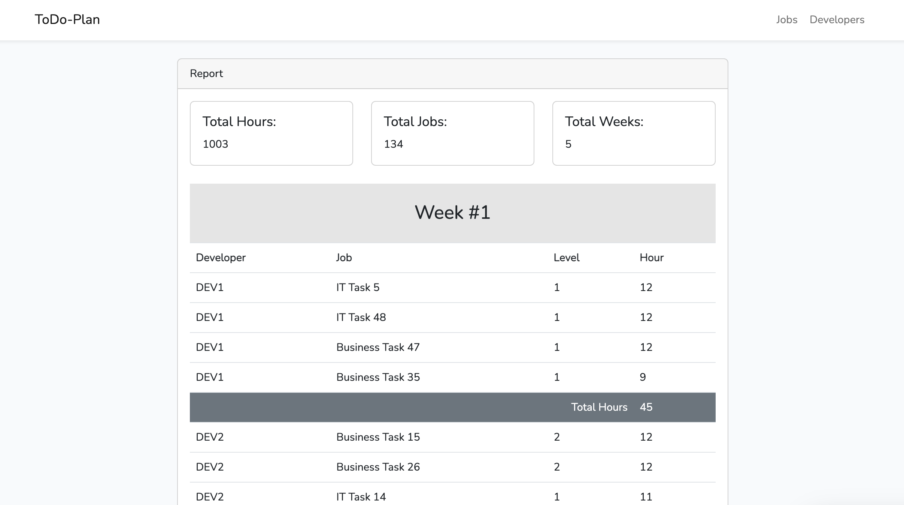

# ToDo-Planner

Farklı servislerden iş kayıtlarını toplayarak bunları geliştiricilere haftalık olarak dağıtan bir uygulama.



## Bilgisayarınızda Çalıştırın

Projeyi klonlayın

```bash
  git clone https://github.com/mcelal/todo-plan.git
```

Proje dizinine gidin

```bash
  cd todo-plan
```

ENV dosyasını oluşturun
```bash
cp .env.example .env 
```

Gerekli paketleri yükleyin

```bash
  composer install
```

SQLite veri tabanını oluşturun

```bash
  touch database/todo.sqlite
```

Veri tabanı tablolarını oluşturun

```bash
  php artisan migrate --seed
```

App key üretin
```bash
 php artisan key:generate
```

Front-end paketlerini yükleyin
```bash
  yarn install
```

Front-end derlemesini yapın
```bash
  yarn run build
```

Sunucuyu çalıştırın

```bash
  php artisan serve
```

## Verilerin çekilmesi
Servislerden verileri çekmek için arayüzden Jobs sayfası içerisinde ki ReImport butonunu kullanabilir veya aşağıda ki şekilde komut çalıştırabilirsiniz.

```bash
  php artisan app:fetch-jobs
```

